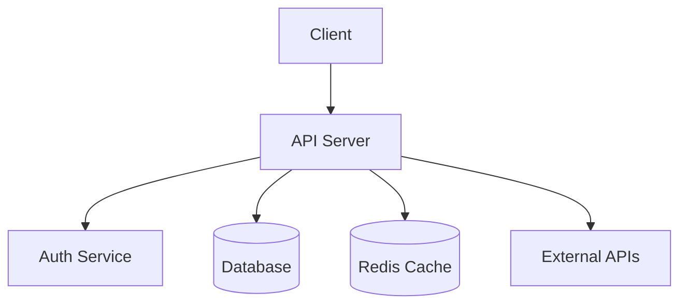
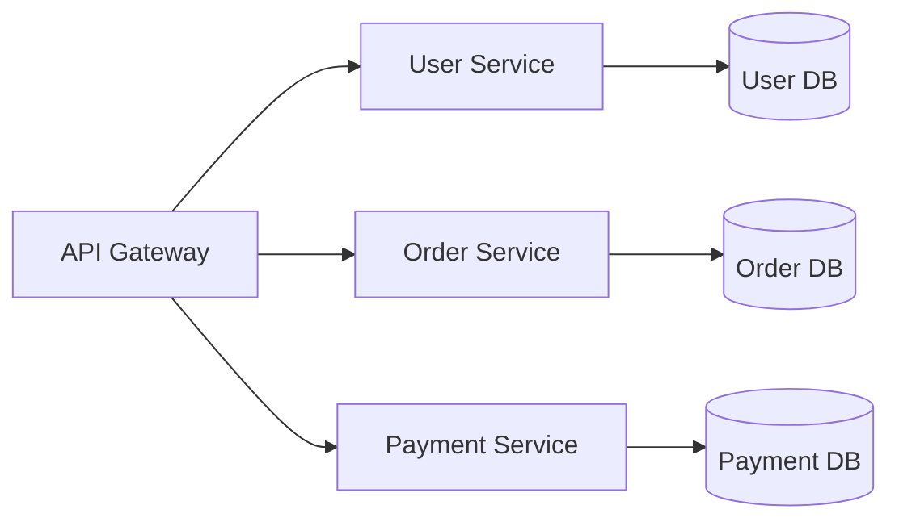
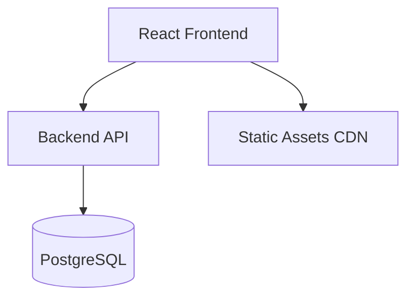

# Project Analyzer Workflow (Universal)

**Purpose:** Analyze ANY project structure, identify teknologi yang digunakan, dan create comprehensive overview. Works for any programming language/framework.

**Use Cases:**
- Onboarding ke project baru
- Understanding unfamiliar codebase
- Documentation generation
- Tech stack audit
- Architecture assessment

---

## Analysis Steps

### 1. Project Structure Scan

List directory tree structure:

**Windows PowerShell:**
```powershell
Get-ChildItem -Recurse -Depth 2 | 
    Select-Object FullName, @{Name="Type";Expression={if($_.PSIsContainer){"Directory"}else{"File"}}}, Length |
    Format-Table -AutoSize
```

**Cross-Platform (tree command):**
```bash
# Windows
tree /F /A

# Linux/Mac
tree -L 3
```

**Report:**
- Directory structure (3 levels deep)
- File counts per directory
- Total project size

---

### 2. Technology Detection

Scan for tech stack indicators:

**Backend Detection:**

**Python:**
- `requirements.txt`, `Pipfile`, `pyproject.toml`
- `app.py`, `main.py`, `manage.py`
- Frameworks: FastAPI, Django, Flask

**Node.js/JavaScript:**
- `package.json`, `yarn.lock`
- `index.js`, `server.js`, `app.js`  
- Frameworks: Express, Nest.js, Koa

**Go:**
- `go.mod`, `go.sum`
- `main.go`
- Frameworks: Gin, Echo, Fiber

**PHP:**
- `composer.json`
- `index.php`
- Frameworks: Laravel, Symfony

**Java:**
- `pom.xml` (Maven), `build.gradle` (Gradle)
- `*.java` files
- Spring Boot, Jakarta EE

**Ruby:**
- `Gemfile`
- `*.rb` files
- Rails, Sinatra

---

**Frontend Detection:**

**React:**
- `package.json` with "react" dependency
- `src/App.jsx`, `src/index.jsx`

**Next.js:**
- `next.config.js`
- `pages/` directory

**Vue:**
- `package.json` with "vue"
- `*.vue` files

**Angular:**
- `angular.json`
- `*.component.ts`

**Svelte:**
- `svelte.config.js`
- `*.svelte` files

**Plain HTML/CSS:**
- `index.html`
- `*.css`, `*.scss`

---

**Database Detection:**

**PostgreSQL:**
- Connection strings: `postgresql://`
- Config files mentioning postgres

**MySQL:**
- Connection strings: `mysql://`
- `my.cnf` config

**MongoDB:**
- Connection strings: `mongodb://`
- `mongoose` in dependencies

**SQLite:**
- `*.db`, `*.sqlite` files

**Supabase:**
- `SUPABASE_URL` in env variables

**Firebase:**
- `firebase.json`
- `firebaseConfig` in code

---

**Infrastructure Detection:**

**Containerization:**
- `Dockerfile`
- `docker-compose.yml`

**CI/CD:**
- `.github/workflows/` (GitHub Actions)
- `.gitlab-ci.yml` (GitLab)
- `Jenkinsfile` (Jenkins)

**Deployment:**
- `vercel.json` (Vercel)
- `netlify.toml` (Netlify)
- `railway.toml` (Railway)
- `fly.toml` (Fly.io)

---

### 3. Dependency Analysis

**Python:**
```bash
pip list
# Or read requirements.txt
Get-Content requirements.txt
```

**Node.js:**
```bash
npm list --depth=0
# Or read package.json
Get-Content package.json | ConvertFrom-Json | Select-Object -ExpandProperty dependencies
```

**Go:**
```bash
go list -m all
```

**PHP:**
```bash
composer show
```

**Report:**
- Total dependencies count
- Key dependencies (frameworks, databases, APIs)
- Potential outdated packages

---

### 4. Architecture Analysis

**Identify Patterns:**

**MVC (Model-View-Controller):**
- `models/`, `views/`, `controllers/`
- Common in: Django, Rails, Laravel

**Service Layer:**
- `services/`, `routes/`, `models/`
- Common in: Modern APIs (FastAPI, Express)

**Microservices:**
- Multiple services in directories
- Each with own dependencies

**Monolith:**
- Single application structure
- All code in one codebase

**Serverless:**
- Function-based structure
- `functions/`, `lambda/`

---

### 5. Code Metrics

**File Statistics:**

**PowerShell:**
```powershell
# Count files by extension
Get-ChildItem -Recurse -File | 
    Group-Object Extension | 
    Select-Object Name, Count | 
    Sort-Object Count -Descending

# Total lines of code (Python example)
$totalLines = 0
Get-ChildItem -Recurse -Filter "*.py" | ForEach-Object {
    $totalLines += (Get-Content $_.FullName | Measure-Object -Line).Lines
}
Write-Host "Total Python lines: $totalLines"
```

**Report:**
- Total files per language
- Total lines of code (approx)
- Average file size
- Largest files (top 5)

---

### 6. Configuration Analysis

**Environment Variables:**
- Check `.env.example` exists (don't read `.env`)
- List required environment variables

**Build Config:**
- Build commands from `package.json`, `Makefile`, etc.
- Entry points

**Deployment Config:**
- Platform-specific settings
- Environment requirements

---

### 7. Create Architecture Diagram

Generate Mermaid diagram based on detected structure:

**Example for API Project:**


**Example for Microservices:**


**Example for Full-Stack:**


---

### 8. Generate Comprehensive Report

```markdown
# Project Analysis Report

## Executive Summary
- Project Name: [detected from package.json/README]
- Primary Language: [language]
- Framework: [framework]
- Architecture: [MVC/Service Layer/Microservices]
- Purpose: [brief description from README]

## Tech Stack

### Backend
- Language: [Python/Node.js/Go/etc]
- Framework: [FastAPI/Express/etc]
- Version: [if detectable]

### Frontend  
- Framework: [React/Vue/Angular/etc]
- Build Tool: [Vite/Webpack/etc]

### Database
- Type: [PostgreSQL/MongoDB/etc]
- ORM: [SQLAlchemy/Prisma/etc]

### Infrastructure
- Deployment: [Vercel/AWS/etc]
- Containers: [Docker: Yes/No]
- CI/CD: [GitHub Actions/etc]

## Project Structure

[Directory tree or key folders explanation]

## Architecture Pattern
[Detailed description of detected pattern]

## Key Components

### API Endpoints (if applicable)
- [List detected routes/endpoints]

### Services/Modules
- [List main services detected]

### Models/Entities
- [List data models]

## Dependencies

### Production
- Total: [count]
- Key packages: [list top 5-10]

### Development
- Total: [count]
- Testing: [pytest/jest/etc]
- Linting: [ESLint/Black/etc]

## Code Metrics
- Total files: [count by language]
- Lines of code: [approx by language]
- Largest files: [top 3 with sizes]
- Test coverage: [if detectable]

## Configuration
- Build command: [command]
- Start command: [command]
- Test command: [command]
- Environment vars: [count from .env.example]

## Architecture Diagrams

[Mermaid diagram(s)]

## Recommendations

Based on analysis:
1. [Improvement suggestions]
2. [Missing best practices]
3. [Security considerations]
4. [Performance optimizations]
5. [Documentation gaps]

## Next Steps for New Developer

1. Install dependencies: `[command]`
2. Configure environment: Copy `.env.example` to `.env`
3. Run tests: `[command]`
4. Start dev server: `[command]`
5. Access: `http://localhost:[port]`
```

---

### 9. Interactive Q&A

After report, ask user:
1. "Ada specific component yang mau dijelaskan lebih detail?"
2. "Mau saya analyze security concerns?"
3. "Perlu saya check test coverage?"
4. "Mau saya suggest improvements?"

---

## Output Deliverables

1. **Console Report:** Quick overview
2. **Mermaid Diagrams:** Architecture visualization
3. **File:** Save report to `project-analysis-[date].md`

---

## Analysis Modes

**Quick (30 seconds):**
- Steps 1-2 only (structure + tech detection)

**Standard (2-3 minutes):**
- Steps 1-5 (add dependencies + architecture + metrics)

**Deep Dive (5-10 minutes):**
- All 8 steps (complete analysis with diagrams)

**Custom Focus:**
- Security only
- Dependencies only
- Architecture only

---

## Cross-Platform Commands

**File Count (any OS):**
```bash
# PowerShell
(Get-ChildItem -Recurse -File).Count

# Bash
find . -type f | wc -l
```

**Lines of Code:**
```bash
# PowerShell (Python)
(Get-Content -Path (Get-ChildItem -Recurse -Filter "*.py") | Measure-Object -Line).Lines

# Bash
find . -name "*.py" -exec wc -l {} + | tail -1
```

**This workflow helps understand ANY codebase quickly and comprehensively!**
